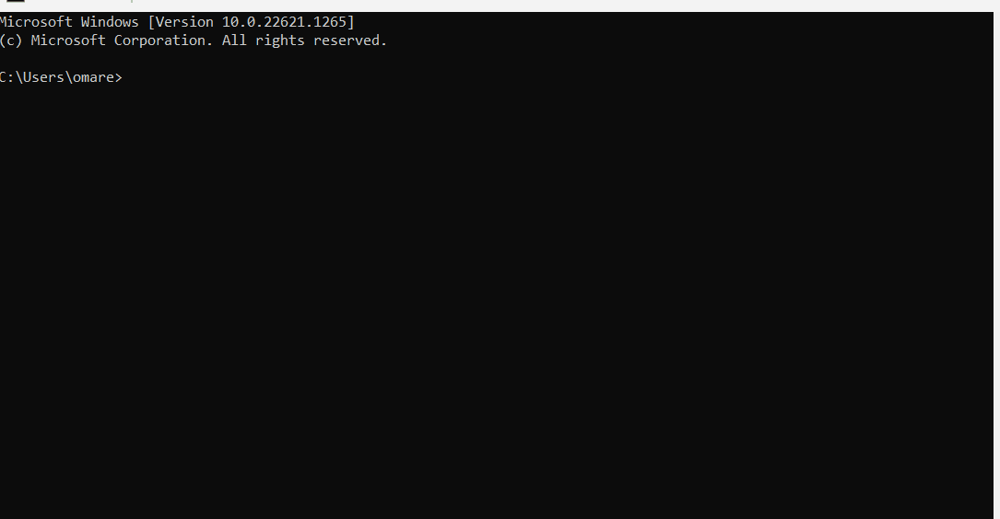
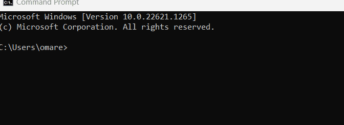
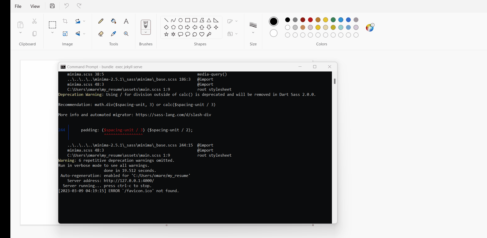

# Hosting Resume On GitHub Pages


## Purpose

#### The purpose of this article is to show how to host your resume on Github using one of the static generator available like [Jekyll](https://jekyllrb.com/).


#### Main goals:
1. Using markdown for writing your resume 
2.  Using Jekyll for creating your resume
3.  Using GitHub to host your static website

## Prerequisites

### There are few prerequisites needed before you start 

##### 1.  GitHub account
   - [Click here to know how to create an account in GitHub](https://docs.github.com/en/get-started/signing-up-for-github/signing-up-for-a-new-github-account)

##### 2. Your resume ready 
   - [Here are good tips for writing a perfect resume](https://www.jobbank.gc.ca/findajob/resources/write-good-resume)

##### 3. Markdown text editor
 * In this tutorial, [VS studio code](https://code.visualstudio.com/) will be used

   
**_If you are struggling to find a free markdown editor,  [Obsidian](https://obsidian.md/) is completely free and it is very easy to use_**

# Getting started

### 1. Formatting a resume using Markdown
1. You need to install your Markdown text editor

2. If you are going to use VS code for writing your resume, you will need to create a new file with a .md extension and split your screen to get a preview and the script side by side, here is a short tutorial:
  

3. To know more about Markdown syntax, here are good resources for Markdown 
   1. [Markdown guide](https://www.markdownguide.org/)
   2. [Markdown tutorial](https://www.markdowntutorial.com/) **_Recommended_** 
   3. [CommonMark tutorial](https://commonmark.org/help/tutorial/) 

    &nbsp;

An awesome tip to consider while writing resume from _**Modtern Technical Writing, by Andrew Etter**_ 
1. **Consistency**: Always make all sections of your resume consistent with the same formatting
2. **Don't duplicate**: Break you resume into sections and don't duplicate

---

### 2. Install Jekyll
**Prerequisities:**
1. Check if you have the Ruby version 2.5.0 or higher
  - You can check using ```ruby-v ``` in your command line

  
  If you don't have it or it's not higher than 2.5.0, you can download it from here [Ruby version 2.5.0 or higher](https://www.ruby-lang.org/en/downloads/)

2. [RubyGems](https://rubygems.org/pages/download)
   - You can check using ```gcc -v ``` ,  ```g++ -v ``` in your command line ( if any is missing, you can download them from [here](https://gcc.gnu.org/install/)).


Now to install Jekyll, you need to write on the command line ```gem install jekyll bundler ```


---

### 3. Creating new Jekyll site
Now after installing Jekyll, we can start building a Jekyll site

 1. To create a new site, you will need to write this command ```jekyll new ``` follow by ```your project name ```

  

  2. Now you need to go to the new directory, so you will need the command ```cd ``` followed by ```your project name ```
  3. Now to compile the site that's already automatically generated by Jekyll, you will need this command  ```bundle exec jekyll serve ```
  
  4. You will get a link for the localhost port that your generated website is uploaded on, you will copy/paste this link to your browser
    
